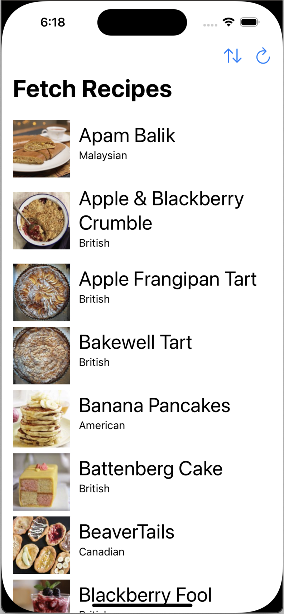
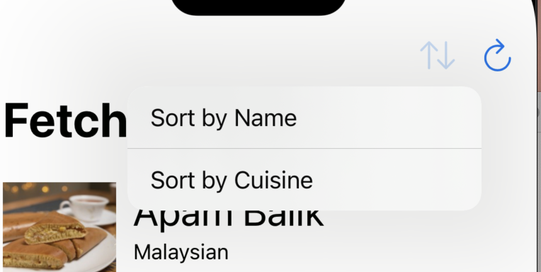
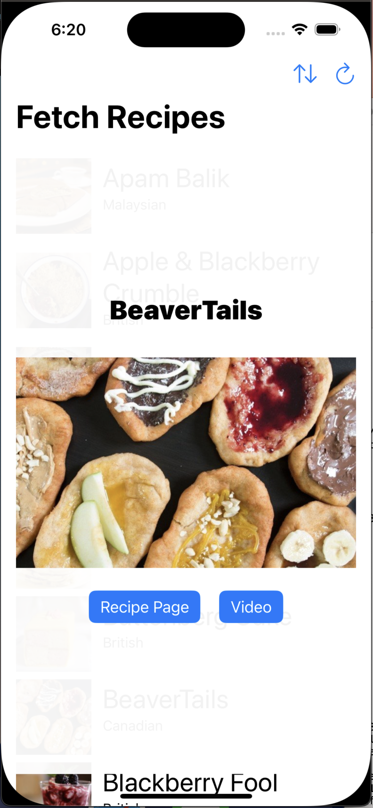

### Summary: Include screen shots or a video of your app highlighting its features

Fetch Recipes demonstrates fetching a list of recipes from a REST endpoint, parsing the resulting JSON data into models, and displaying the result in a scrolling list for the user. Cells are loaded lazily, and images are loaded on demand and cached locally.

The main recipe list is shown with small images and the name and cuisine visible.

Navigation bar buttons are provided to reload data on demand, and specify whether recipes are sorted by name or by cuisine (name is the default).

Selecting any recipe in the list displays a detail overlay with the larger image and button affordances to navigate to web source content or YouTube video in the user's browser.

### Focus Areas: What specific areas of the project did you prioritize? Why did you choose to focus on these areas?

I emphasized function and testing of the service object that fetches recipe data, and the image loader object which manages fetching and caching images. Management of data is one of the most important functions in an app, and testing is crucial here.

### Time Spent: Approximately how long did you spend working on this project? How did you allocate your time?

I spent a day, around 7 hours, putting together the code and building the UI. I started with the data loading service object and its tests, ensuring I'd be able to access and decode the recipes. After that, I moved on to the image loader, ensuring images were loaded asynchronously, cached locally, and retrieved from cache when possible, confirming functionality with unit tests. Finally, I built the UI, starting at the main list view, and then filling in details of the smaller component views.

### Trade-offs and Decisions: Did you make any significant trade-offs in your approach?

Since the project is restricted to a single view, I did not navigate to a separate view for viewing recipe details, but display them in an overlay instead. I also push the user out to their browser when source and/or video URLs are provided, where I would have preferred to show that web content in a modal normally.

I would also have liked to build in a testing interface to more easily exercise the empty and error views.

### Weakest Part of the Project: What do you think is the weakest part of your project?

The design. I'm not really a designer, so the design needs plenty of polish. I didn't spend any extra time creating assets for buttons, choosing to use system SF Symbols instead as an expediency.

### Additional Information: Is there anything else we should know? Feel free to share any insights or constraints you encountered.